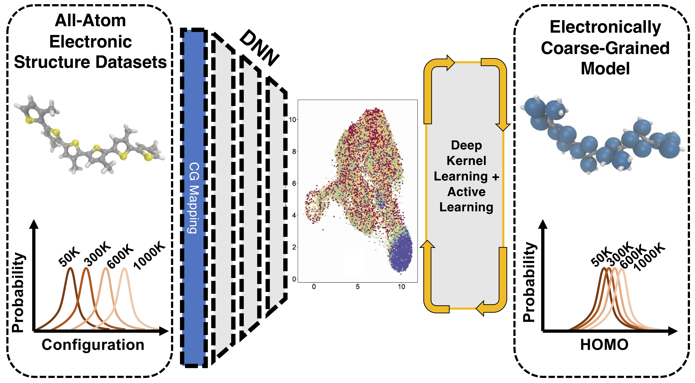

# AL4ECG : Active Learning for Electronic Coarse Graining 

</img>

Documentation for the active learning (AL) workflow developed as a part of the article "Coarse-Grained Density Functional Theory Predictions via Deep Kernel Learning". 
__For more details, please refer to the [paper](https://www.url_to_be_added.com).__


## What are the capabilities of AL4ECG workflow ?

The workflow is built as a [PyTorch](https://pytorch.org) based GPU accelerated framework and offers the following capabilities:

* GPU accelerated Scalable Gaussian Processes and Exact Deep Kernel Learning (DKL) based on [GPyTorch library](https://gpytorch.ai)
* Bayesian Optimization for hyperparameter tuning of  DKL using the [GPyOpt library](https://github.com/SheffieldML/GPyOpt)
* PyTorch based numeric implementation of AL query strategies using standard GPR based uncertainty and beyond.
* Capable of running on the state-of-the-art [NVIDIA A100 GPU's](https://www.nvidia.com/en-us/data-center/a100/) available at the [LCRC SWING cluster](https://www.lcrc.anl.gov/systems/resources/swing/) and the [ALCF ThetaGPU](https://www.alcf.anl.gov/support-center/theta/theta-thetagpu-overview#theta-gpu).


## What are the type of  supervised learning method  and  AL queries are supported in the  AL4ECG workflow?

###  Supervised learning methods
* Gaussian Process Regression: Single and Multi-task
* [Deep Kernel Learning](http://proceedings.mlr.press/v51/wilson16.html) 

### Kernels
* Matern 
* RBF

### AL queries
* Random 
* [Uncertainty](https://link.springer.com/article/10.1007/s11263-009-0268-3) 
* Expected Model Output Changes [(EMOC)](https://link.springer.com/chapter/10.1007/978-3-319-10593-2_37)

## Installation 

Running GPyTorch on A100 GPU has the following basic requirment:

* MAGMA + CUDA 11.0


The step-by-step compilation is covered in [INSTALLATION.MD](https://github.com/TheJacksonLab/ECG_ActiveLearning/blob/main/INSTALLATION.MD)


## How to run the workflow?

Running the workflow is extensively covered in [RUN.MD](https://github.com/TheJacksonLab/ECG_ActiveLearning/blob/main/RUN.MD)

## How do i cite AL4ECG workflow ?

If you are using this active learning workflow  in your research paper, please cite us as
```
@article{AL4ECG,
  title={Coarse-Grained Density Functional Theory Predictions via Deep Kernel Learning},
  author={Sivaraman, Ganesh and Jackson, Nicholas},
  journal={XX},
  volume={YY},
  number={ZZ},
  pages={BB},
  year={2021},
  publisher={ Publishing Group}
}
```

## Acknowledgements
This material is based upon work supported by Laboratory Directed Research and Development (LDRD-CLS-1-630) funding from Argonne National Laboratory, provided by the Director, Office of Science, of the U.S. Department of Energy under Contract No. DE-AC02-06CH11357. This research used resources of the Argonne Leadership Computing Facility, which is a DOE Office of Science User Facility supported under Contract DE-AC02-06CH11357. Argonne National Laboratory’s work was supported by the U.S. Department of Energy, Office of Science, under contract DE-AC02-06CH11357.  We gratefully acknowledge the computing resources provided on Bebop and  Swing,  high-performance computing clusters operated by the Laboratory Computing Resource Center at Argonne National Laboratory.

## Code contributor
* Ganesh Sivaraman <gsivaraman:AT::anl.gov>
* Nicholas Jackson <jackson.nick.e::aT:gmail.com>
